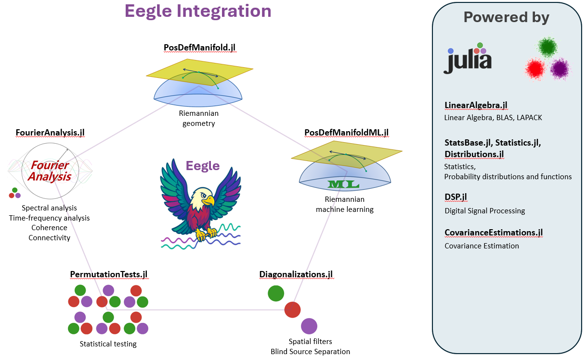

# Eegle Documentation
The EEG General Library (**Eegle**) is a general-purpose package for
preprocessing and processing human Electroencephalography (EEG) data.

It is the foundational building block that enables the integration of diverse
state-of-the-art packages, leveraging the powerful [Julia](https://julialang.org/) scientific eco-system.

It also provides some modules for advanced EEG analysis.

**Eegle** promotes standardization, conventions and a learning approach based on simple examples and advanced tutorials.



## Requirements 

**Julia**: version ≥ 1.10

## Installation

Execute the following commands in Julia's REPL:

```
]add Eegle
```

## About the Authors

[Marco Congedo](https://sites.google.com/site/marcocongedo), corresponding author, is a Research Director of [CNRS](http://www.cnrs.fr/en) (Centre National de la Recherche Scientifique), working at [UGA](https://www.univ-grenoble-alpes.fr/english/) (University of Grenoble Alpes). **Contact**: first name dot last name at gmail dot com

[Fahim Doumi](https://www.linkedin.com/in/fahim-doumi-4888a9251/?locale=fr_FR) at the time of writing was a research ingeneer at the Department of Enginnering of the [University federico II of Naples](https://www.unina.it/en_GB/home).

## TroubleShoothing
| Problem   | Solution |
|:----------|:----------|
| No problem encountered so far |  N.A.|

## Reviewers & Contributors

Independent reviewers for both the code and the documentation are welcome.
To contribute, please check the secion [How to Contribute](@ref).

## Contents

```@contents
Pages = [       "index.md",
                "Eegle.md",
                "FileSystem.md",
                "Preprocessing.md",
                "Processing.md",
                "Miscellaneous.md",
                "ERPs.md",
                "CovarianceMatrix.md",
                "Database.md",
				"references.md",
		]
Depth = 1
```

## Index

```@index
```
