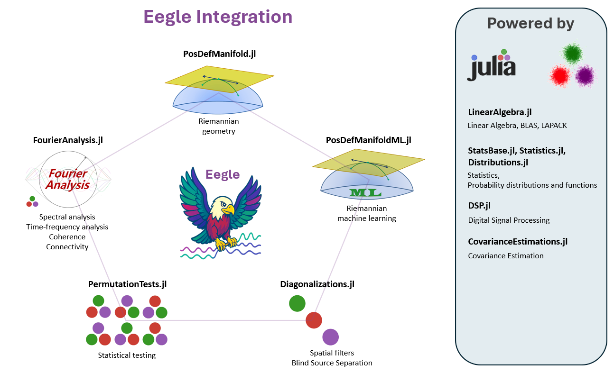

# Summary

Existing since the 1920s, Electroencephalography (EEG) is the first non-invasive neuroimaging modality developed by mankind. Despite many more sophisticated modalities having been developed since, to date EEG is still by far the most widely used. This is due to a number of distinct advantages over other modalities, such as the high temporal resolution, the low price and encombrement of equipment, the silent operation and the total non-invasiveness.

The recent explosion of research on EEG-based Brain-Computer Interfaces (BCIs) has fostered the need for efficient tools for EEG analysis and machine learning. While such tools exist for older languages such as Python and Matlab, they are not available for the more recent Julia language, which has been specifically created with these needs in mind. *Eegle.jl* leverages the rich and efficient scientific Julia ecosystem and integrates it to offer a simple and unified framework for both EEG data analysis and machine learning. In order to promote inter-operability of Julia and Python, we also release *pyLittleEegle*, a Python clone of the BCI-related capabilities found in *Eegle.jl*. Both packages work seamlessly with the *FII BCI Corpus*, the first large curated and annotated databases for the motor imagery and P300 BCI modalities.

# Statement of need

In 1893 Hans Berger fell off his horse during his military training in Germany and was nearly trampled. On that same day, his sister had a bad feeling about Hans and wrote him a telegram asking if everything was all right. To the 19 y.o. man, the coincidence appeared stunning. He thought that he had somehow transmitted his feelings to his sister with some form of 'telepathy' [@Bouszaki:2006]. He then decided to become a psychiatrist and to apply science to study the phenomenon. Based upon previous research of Richard Caton on the electrical activity of the exposed cortex of monkeys [@Caton:1875], he obtained the first human electroencephalographic recording in the middle of the 1920s [@Berger:1929].

Berger would have never imagined that, a century later, his creature would be the cornerstone of a new form of 'telepathy', known as Brain-Computer Interface (BCI). By means of an EEG-based BCI, a human can send a command to a machine relying entirely on the EEG readings. In fact, a BCI is defined as a system that enables the information transfer without using the muscles or the peripheral nerves [^1] at all [@WolpawWolpaw:2012]. The EEG has been instrumental for the inception of this research, due to the seminal work of Jacques Vidal [@Vidal1973]. Still today, EEG is by far the preferred neuroimaging modality for non-invasive BCIs thanks to its unique characteristics:

- High temporal resolution (~1ms),
- Instantaneous measure of brain electrical potentials (no delay in the measure),
- High consistency (e.g., same EEG power spectra on the same individuals on two successive days at the same hour),
- Sensitivity (for example, it is very useful for the detection of epilepsy and minimal consciousness states),
- Solid research tradition (one century-long),
- Total silentness and truly non-invasiveness (e.g., allowing daily use on anybody, including newborn children and patients with any condition),
- Need of small, light, and inexpensive equipment (the size of EEG electronics can be reduced to the size of a common chip),
- Use of wireless recording in natural (out-of-the-lab) environments.

While BCI research is relatively new, EEG has a long-standing tradition in clinical and cognitive brain research. All-in-all, a search on PubMed for the terms ("EEG" or "electroencephalography") yielded 217,075 results on Jan 17 2026, with a positive trend starting at the dawn of the third millennium, a phenomenon that we name the 'rebirth of EEG'.

Older languages such as Python and Matlab have their established software ecosystems for EEG data analysis and machine learning. Here below are the most frequently adopted software:

## Python
| Package   | Description |
|:------------|:------------|
| MNE[@mne:2013] | Open-source Python package for exploring, visualizing, and analyzing human neurophysiological data: MEG, EEG, sEEG, ECoG, NIRS, and more |
| scikit-learn[@scikit-learn:2011] | Machine learning in Python (generic, not specific to EEG) |
| Braindecode[@braindecode:2025] | Braindecode: toolbox for decoding raw electrophysiological brain data with deep learning models |

## Matlab
| Package   | Description |
|:------------|:------------|
| EEGLAB[@eeglab:2004] | An interactive Matlab toolbox for processing continuous and event-related EEG, MEG |
| FieldTrip[@fieldtrip:2011] | Open-source software for advanced analysis of MEG, EEG, and invasive electrophysiological data |
| Brainstorm[@brainstorm2011] | A user-friendly application for MEG/EEG analysis |

In the Julia language, instead, the ecosystem for EEG data is poor and scattered. However, the use of Julia may greatly benefit the field.  

## Julia

Julia is a young open-source and cross-platform language specifically conceived for scientific computing [@julia2017]. It is rapidly gaining momentum in the scientific community thanks to its conceptual affinity with mathematics and compatibility with the best available computing protocols. Although it is a high-level language, like Python and Matlab, it is (just-in-time) compiled, thus it can be very efficient. Typically, Julia code runs at a speed within a factor of two relative to fully optimized C code, thus it can be an order of magnitude faster compared to Python or R and about four times faster compared to Matlab. Moreover, Julia syntax is elegant and permissive, allowing the programmer to adopt his/her preferred writing style. That is to say, the same routine in Julia can be written using a syntax closely resembling C, Python, or Matlab, to name a few. This makes the learning of the Julia language particularly pleasant.

# Software design

In this context, we have created for the Julia language *Eegle*, the *EEG General Library* [@Eegle:2026]. [Eegle.jl](https://github.com/Marco-Congedo/Eegle.jl) is a general-purpose package for EEG data analysis and machine learning. It is the foundational building block that enables the integration of diverse state-of-the-art packages specifically conceived for EEG data, leveraging the powerful Julia scientific ecosystem.

{ width=95% }

[Eegle.jl](https://github.com/Marco-Congedo/Eegle.jl) is organized as a collection of independent modules. They are all re-exported, along with fundamental external packages.

### Internal modules

| Code Unit   | Description |
|:------------|:------------|
| `BCI.jl` | Brain-Computer Interface machine learning based on Riemannian geometry |
| `Database.jl` | Utilities for handling and selecting databases |
| `ERPs.jl` | Operations on Event-Related Potentials and BCI trials |
| `FileSystem.jl` | Manipulation of files and directories |
| `InOut.jl` | Reading and writing of data |
| `Miscellaneous.jl` | Miscellaneous functions |
| `Preprocessing.jl` | EEG preprocessing |
| `Processing.jl` | EEG processing |

### Re-exported external packages

| Package | Scope |
|:-----------------------|:-----------------------|
| [CovarianceEstimation.jl](https://github.com/mateuszbaran/CovarianceEstimation.jl) | Covariance matrix estimations |
| [Diagonalizations.jl](https://github.com/Marco-Congedo/Diagonalizations.jl) | Spatial filters, (approximate joint) diagonalization algorithms |
| [Distributions.jl](https://github.com/JuliaStats/Distributions.jl) | Julia standard package for statistical distributions |
| [DSP.jl](https://github.com/JuliaDSP/DSP.jl) | Julia standard package for digital signal processing |
| [FourierAnalysis.jl](https://github.com/Marco-Congedo/FourierAnalysis.jl) | FFT-based frequency domain and time-frequency domain analysis |
| [LinearAlgebra.jl](https://bit.ly/2W5Wq8W) | Julia standard package for matrix types and linear algebra (BLAS, LAPACK) |
| [NPZ.jl](https://github.com/fhs/NPZ.jl) | Support for the *NPZ* (NumPy) binary data format |
| [PermutationTests.jl](https://github.com/Marco-Congedo/PermutationTests.jl) | Low-level statistics, very fast (multiple comparison) permutation tests |
| [PosDefManifold.jl](https://github.com/Marco-Congedo/PosDefManifold.jl) | More linear algebra, operations on the manifold of positive-definite matrices |
| [PosDefManifoldML.jl](https://github.com/Marco-Congedo/PosDefManifoldML.jl) | Machine learning on the manifold of positive-definite matrices |
| [StatsBase.jl](https://github.com/JuliaStats/StatsBase.jl) | Julia standard package for basic statistics |
| [Statistics.jl](https://bit.ly/2Oem3li) | Julia standard package for statistics |

This organization follows the spirit of Julia: it allows the centralization of all the above resources under a single package, yet it allows each package to be fully independent (including the documentation) to enable independent development and maintenance of each package.  
As a consequence of this organization, `Eegle.jl`.

# FII BCI Corpus

[Eegle.jl](https://github.com/Marco-Congedo/Eegle.jl) features a GUI for downloading the **FII BCI Corpus**[@FIIBCICorpusMI:2025; @FIIBCICorpusP300:2025]. The corpus comprises a selection of BCI databases annotated and curated for both the motor imagery and P300 BCI paradigms. Along with EEG data and class labels, the corpus provides comprehensive metadata that allow selecting the data for the study at hand and extracting relevant information. This makes it particularly easy and principled to carry out machine learning research on BCI data — see, for example, the [Tutorial ML 2](https://marco-congedo.github.io/Eegle.jl/stable/Tutorials/Tutorial%20Machine%20Learning%202/#Tutorial-ML-2) of `Eegle.jl`.

# pyLittleEegle

The capabilities of [Eegle.jl](https://github.com/Marco-Congedo/Eegle.jl) related to database selection using the FII BCI Corpus have been cloned and translated into the Python language, yielding the **pyLittleEegle** package [@pyLittleEegle:2025]. This package is fully compatible with scikit-learn[@scikit-learn:2011], thus making the corpus easily accessible in Python as well. 

# License

`Eegle.jl` is released under the MIT license.

# AI usage disclosure

Generative AI tools were used in the development of this software only for hastening the writing of non-computing routines, 
such as the download GUI and some routines for the automatic generation of code blocks in the tutorials.  
For writing the manuscript, generative AI tools have been used only for spelling and grammar error checking.

# Acknowledgements

We acknowledge the contributions to `Eegle.jl` of Dr. Alexandre Bleuzé and of Abdeljalil Anajjar.

[^1]: it is a peripheral nerve, for instance, that controls the movements of the eyes, which can be used to send commands.

# References
